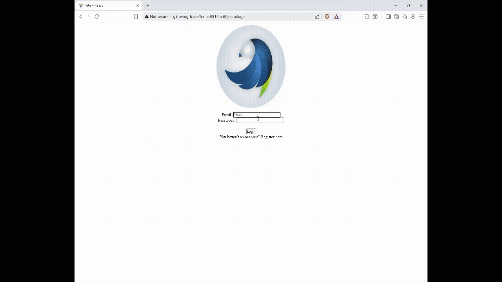
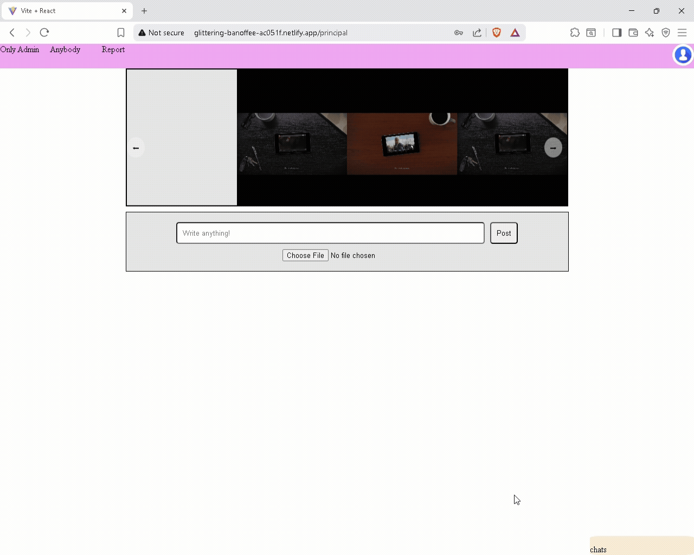
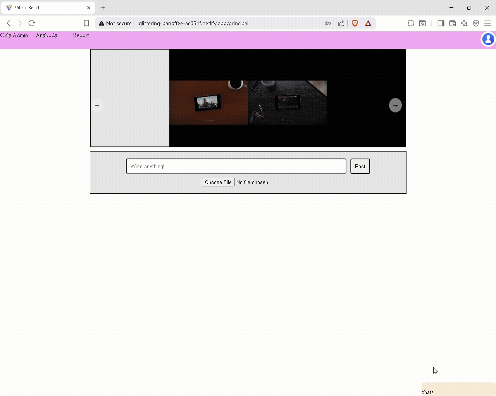

# Facebook Clon

Proyecto de un clon de Facebook con **chat funcional entre usuarios**. Este proyecto fue desarrollado con fines de aprendizaje y portafolio, utilizando **React** en el frontend, **NestJS** en el backend y **MySQL** como base de datos. Está desplegado públicamente para prueba de funcionalidad.

---

## Tecnologías utilizadas

- **Frontend:** React, Vite, CSS
- **Backend:** NestJS, Node.js,JavaScript y TypeScript
- **Base de datos:** MySQL
- **Procedimientos almacenados:** para manejo de chat y mensajes
- **Deploy:** 
  - Frontend en Netlify: [clon-face-book-dz.netlify.app/](clon-face-book-dz.netlify.app/)
  - Backend en Railway: [facebook-clon-nestjs-production.up.railway.app]

## Funcionalidades principales

1. **Registro y login de usuarios**
   - Los usuarios pueden registrarse con nombre, correo y contraseña.
   - Autenticación básica y manejo de sesiones.

2. **Usuarios**
   - Actualizacion de sus datos.   

3. **Chat entre usuarios**
   - Los usuarios pueden enviar mensajes a otros usuarios registrados.
   - Mensajes se guardan en la base de datos mediante **procedimientos almacenados**.
   - La UI muestra los mensajes guardados y nuevos en tiempo real.
   - Interaccion con la IA de DeepSeek mediante chat.

4. **Seguridad**
   - Creacion de token al ingresar.
   - Validacion del token existente
   - Permisos por roles.
   - Almacenamiento del token mediante una cookie no visible.
   - Eliminacion de la cookie por tiempo o al cerrar la sesion para mayor seguridad.

5. **Persistencia de datos**
   - Base de datos MySQL para usuarios y mensajes.
   - Procedimientos almacenados para manejo seguro de inserciones y transacciones.

---
###Funcionalidades principales

**Registro y login**


**Chat entre usuarios**



## Instalación y ejecución local

1. Clonar los repositorios:

```bash
git clone https://github.com/darwinz107/Facebook_clon.git
git clone https://github.com/darwinz107/Facebook-Clon-NestJs.git
